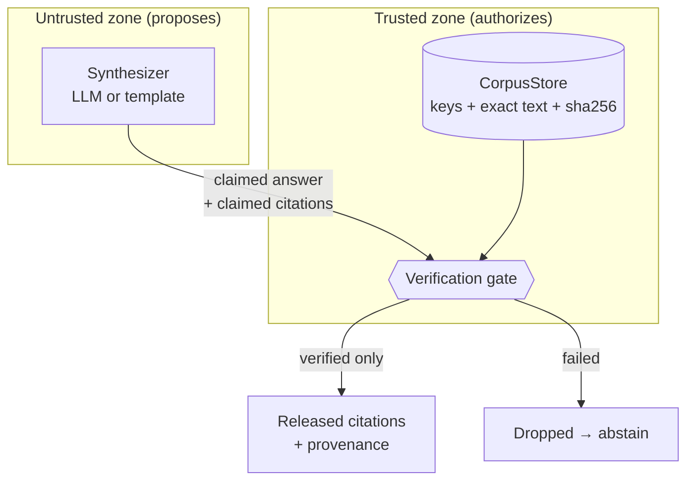
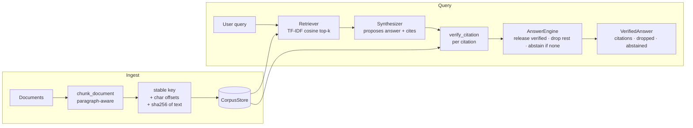
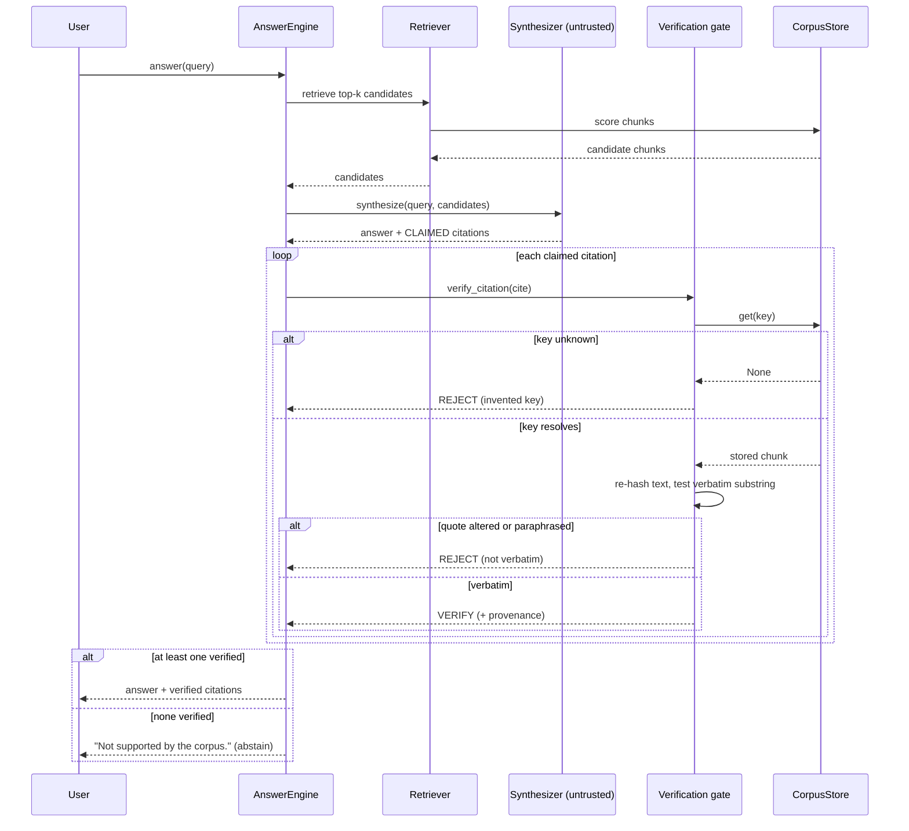

# Architecture & Case Study — Verified RAG

> A reference write-up of a retrieval-augmented answer engine whose defining
> property is that it **cannot emit a fabricated citation.** Clean-room and
> generic by design — no proprietary corpora, prompts, embeddings, or endpoints
> are included; the demo runs on a public-domain toy corpus.

## 1. Context & problem

The headline failure mode of LLM-grounded answering is the **fabricated
citation**: a model cites a source that doesn't exist, or "quotes" text a real
source never contained. *Mata v. Avianca* (2023) is the canonical example — a
legal brief citing entirely invented cases, produced by a model and filed as
fact, resulting in sanctions. The same failure shows up anywhere an LLM cites:
research assistants, compliance tools, medical Q&A, internal knowledge bases.

Retrieval-Augmented Generation is usually offered as the fix. It helps with
*recall* — the model now has real passages in context — but it does **not**
close the fabrication hole:

- The model can cite a **key you never supplied** (it pattern-matches what a
  citation "looks like").
- The model can **reword a real quote** just enough to be wrong while looking
  right.

Prompting ("only use the sources"), a bigger model, or temperature 0 all
*reduce* the rate. **None of them provide a guarantee.** For a system where a
single fabricated cite is a serious incident, "lower rate" is not an
architecture — it's a hope.

**Thesis:** don't try to make the model trustworthy. Make the *system* verify
the model. Move the trust boundary so that no citation can leave without being
checked against the authoritative corpus.

## 2. The trust boundary

The single most important decision in this design is *where trust lives.*

The synthesizer may **propose** anything. It has **no authority to release** a
citation. Only the gate — which consults the authoritative `CorpusStore` —
releases. This is why the guarantee holds regardless of which synthesizer you
plug in, and regardless of how the model misbehaves.

## 3. System architecture

### The verification sequence

## 4. Components

| Component | File | Responsibility | Trust |
|-----------|------|----------------|-------|
| `Chunk` / `chunk_document` | `chunk.py` | Paragraph-aware chunking; stable keys; char offsets; **sha256 content address** | Trusted data |
| `CorpusStore` | `store.py` | Authoritative keyed index; the **single source of truth** the gate checks against | Trusted |
| `Retriever` | `retrieve.py` | TF-IDF cosine candidate selection. *Proposes* only | Advisory |
| `Synthesizer` | `synthesize.py` | Proposes answer + claimed citations (template or LLM) | **Untrusted** |
| `verify_citation` | `verify.py` | **The gate.** Key resolution + verbatim-span check | Trusted |
| `AnswerEngine` | `engine.py` | Wires it together; releases verified, drops the rest, abstains if none | Trusted |

## 5. Why sha256 / content addressing

Each chunk stores a `sha256` of its exact text, recomputed from the text itself
(a caller cannot forge it — see `Chunk.__post_init__`). Two reasons:

1. **Tamper-evidence.** Verification re-hashes the stored chunk and confirms the
   quote is a real substring of *that* text. If storage were ever corrupted or
   swapped, the integrity check catches it before a citation is released.
2. **Stable provenance.** The hash is a durable content address for a passage —
   useful for caching, dedup, audit logs, and proving "this is the exact text we
   cited" after the fact.

## 6. Abstention as a first-class outcome

Most RAG systems have exactly one output shape: an answer. This one has two —
**answer** or **abstention** — and abstention is not an error. When nothing
survives verification, `AnswerEngine` returns `abstained=True`, the answer text
`"Not supported by the corpus."`, and **zero** citations. This is the honest
outcome, and making it structural (rather than a rare fallback) is what prevents
the system from ever papering over a gap with an invented cite.

## 7. Trade-offs

- **➕ Hard guarantee, model-agnostic.** Fabrication is impossible at the seam,
  not merely rare. Swap in any model or retriever; the property holds.
- **➕ Auditable.** Dropped citations are retained with reasons; released ones
  carry full provenance.
- **➖ Recall vs. safety.** Exact-substring verbatim matching will reject a quote
  that differs only in whitespace or curly-vs-straight quotes. This is a
  deliberate bias toward safety; normalization is an *audited* extension point
  (ADR 0003), never a silent loosening.
- **➖ Integrity ≠ correctness.** The gate proves a citation is real and verbatim.
  It does not prove the cited passage answers the question. Faithfulness scoring
  is a complementary layer, out of scope for the guarantee itself.

## 8. Extending it

- **Retriever:** replace `Retriever` with embeddings/BM25/a vector DB. The gate
  is untouched — retrieval only proposes candidates.
- **Synthesizer:** implement the `Synthesizer` protocol (`synthesize(query,
  candidates) -> Proposal`). The gate verifies whatever it returns.
- **Store backend:** back `CorpusStore` with a database; keep `get(key)`
  authoritative and keep the sha256 recomputed-from-text invariant.

## Decision records

- [ADR 0001 — Verify citations, don't trust the model](docs/adr/0001-verify-not-trust.md)
- [ADR 0002 — Content-addressed chunks (sha256) for verbatim verification](docs/adr/0002-content-addressed-chunks.md)
- [ADR 0003 — Abstain over fabricate; exact-substring matching](docs/adr/0003-abstain-over-fabricate.md)
