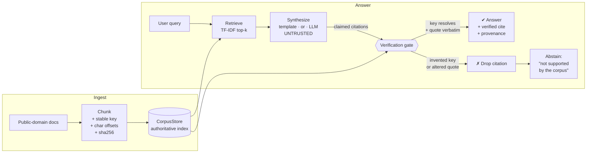

<!-- Copyright © 2026 SurgeXi Business Intelligence, a Teamsmith Enterprises LLC company. All Rights Reserved. -->
# 🔒 verified-rag

> A retrieval-augmented answer engine that **structurally cannot fabricate a citation.** Every citation it emits is verified against the source corpus — real key, verbatim quote — or the engine honestly abstains. There is no code path that returns an unverified citation.

[](https://github.com/tsmith-surgexi/verified-rag/actions/workflows/ci.yml)
[](LICENSE)
[](requirements.txt)

This is a clean-room reference implementation of the "never-fabricates" pattern
I use in production. It runs on a tiny **public-domain** toy corpus with **zero
API keys**, so you can read the technique end-to-end in one sitting.

---

## See it run — real output, zero keys

`python -m verified_rag.demo` runs against a small public-domain corpus with no API keys:

```text
(2) Un-groundable query -> HONEST abstention, no invented cite
   Q: What is the airspeed velocity of an unladen swallow?
   A: Not supported by the corpus.  [ABSTAINED - nothing verifiable]

(3) Adversarial synthesizer -> it TRIES to emit an invented key and a
   one-character-tampered quote. The gate drops both:
   VERIFIED [policy-returns#c1]      - quote is verbatim (sha256=a3ccde9d...)
   DROPPED  [supreme-court-9000#c1]  - unknown citation key, not in corpus
   DROPPED  [policy-returns#c1]      - quoted text is not a verbatim substring (altered/invented)
```

The invented citation and the tampered quote are dropped **before release** — there is no code path that emits an unverified citation.

## The problem: LLMs invent citations, confidently

In *Mata v. Avianca* (2023), a lawyer filed a brief citing judicial opinions
that **did not exist** — an LLM had fabricated the case names, quotes, and
reporter cites, and they looked completely real. The court imposed sanctions.
That failure mode is not a legal-industry quirk; it's the default behavior of a
language model asked to ground an answer in sources:

- it will cite a document **that isn't in your corpus**, and
- it will "quote" text **that the real document never contained.**

Retrieval (RAG) helps, but retrieval alone does **not** fix this. You can hand
the model the right passages and it can *still* cite a key you never gave it or
subtly reword a quote. The usual mitigations — a better prompt, a bigger model,
"please only use the sources" — reduce the rate but provide **no guarantee.**

**This repo provides the guarantee** by moving trust out of the model entirely.

## The core idea: verification, not persuasion

Treat the synthesizer (LLM or template — doesn't matter) as **untrusted.**
Whatever it proposes passes through a **verification gate** before any citation
is allowed out:

1. **Key resolution** — the cited key must resolve to a *real stored chunk.* An
   invented key resolves to nothing → dropped.
2. **Verbatim span** — any quoted text must be a *verbatim substring* of that
   chunk's exact text (re-checked against the chunk's `sha256`). Alter one
   character → dropped.

A citation that fails either check is discarded, and the point it supported
**abstains** ("not supported by the corpus") rather than going out unverified.

> **The guarantee, stated plainly:** the engine returns a *real* citation with a
> *verbatim* quote and full provenance, or an *honest abstention.* It is
> structurally incapable of emitting a fabricated citation — not because the
> model is well-behaved, but because unverifiable citations are dropped at the
> gate before they can leave.

## Architecture



The synthesizer is inside the trust boundary of *proposing*; it is **outside**
the trust boundary of *releasing.* Only the gate can release a citation.

## Common mistake → what this does instead

| The common mistake | What verified-rag does instead |
|--------------------|-------------------------------|
| "Prompt the model to only use the sources" and hope | Treats model output as untrusted; **verifies** every citation before release |
| Trust the citation key the model returns | **Resolves** the key against an authoritative store; invented keys resolve to nothing and are dropped |
| Trust that a quoted passage is real | Requires the quote to be a **verbatim substring** of the stored chunk; re-checks against its `sha256` |
| Paper over gaps with a plausible-sounding answer | **Abstains** — "not supported by the corpus" — rather than emit an unbacked claim |
| Ship and measure hallucination rate later | Makes fabrication **structurally impossible** at the seam, so there's no rate to chase |
| Bury provenance | Every released citation carries key, document, **char span**, and content hash |

## What the demo shows

`python -m verified_rag.demo` runs three cases against the toy corpus:

1. **Groundable query** → a cited answer with a **verbatim quote** and full
   provenance (key, doc, char offsets, sha256).
2. **Un-groundable query** ("airspeed velocity of an unladen swallow") → an
   **honest abstention**, with **no invented citation** to fill the gap.
3. **Adversarial synthesizer** → a deliberately dishonest synthesizer tries to
   smuggle out (a) an **invented key** and (b) a **one-character-tampered
   quote**. The gate **drops both**; only the one legitimate, verbatim citation
   survives.

## Quick start

```bash
git clone https://github.com/tsmith-surgexi/verified-rag.git
cd verified-rag
pip install -r requirements.txt   # stdlib-only engine; this installs pytest
python -m verified_rag.demo       # zero API keys required
pytest -q                         # proves the never-fabricate guarantee
```

Expected: the demo prints a grounded+cited answer, an honest abstention, and the
adversarial case dropping the invented key + tampered quote. `pytest` is green.

## Using it in code

```python
from verified_rag import AnswerEngine, CorpusStore

store  = CorpusStore.from_directory("verified_rag/corpus")
engine = AnswerEngine(store)                      # deterministic, no API key

result = engine.answer("What does the preamble establish?")
if result.is_grounded:
    for c in result.citations:                    # every one is verified
        print(c.key, c.title, f"chars {c.start}-{c.end}", c.sha256[:12])
else:
    print(result.answer)                          # honest abstention
```

Every element of `result.citations` has already passed the gate. Anything the
synthesizer proposed that failed verification is in `result.dropped` for audit,
never in `result.citations`.

## Pluggable, optional LLM

The synthesizer is a swappable component. By default it's a **deterministic,
zero-dependency** template synthesizer, so the repo runs offline with no keys.
Set `VERIFIED_RAG_LLM=1` (and configure an OpenAI-compatible endpoint — see
[`.env.example`](.env.example)) to swap in a real model. **The guarantee is
identical either way** — the gate verifies the LLM's output exactly as it
verifies the template's. The model can be as creative as it likes; it cannot get
a fabricated citation past the gate.

## Configuration

`verified-rag` needs **no configuration** to run. The only settings are for the
optional LLM mode, documented in [`.env.example`](.env.example). No secrets are
required or stored.

## Limitations (honest scope)

- **This guarantees citation *integrity*, not answer *correctness*.** It proves
  every cite is real and every quote verbatim. It does not prove the cited
  passage actually answers the question, nor that the synthesizer's surrounding
  prose is a faithful reading of it. Faithfulness/entailment scoring is a
  complementary layer (see the roadmap).
- **Retrieval here is intentionally toy** — pure-Python TF-IDF, chosen so the
  repo runs from a clean clone with no model download. Swap in embeddings/BM25/a
  vector store without touching the guarantee; retrieval only *proposes*
  candidates, it never *authorizes* a citation.
- **The corpus is a public-domain toy set** (US Constitution preamble, an Aesop
  fable, two fictional "policy" docs) purely to demonstrate the technique. No
  real authorities, product data, or proprietary corpora are included.
- **Verbatim matching is exact-substring.** Whitespace/quote normalization for
  fuzzier-but-still-safe matching is a deliberate, auditable extension point —
  it must never widen into "close enough."

## Roadmap

- [ ] Entailment/faithfulness scoring on top of verified citations
- [ ] Pluggable embedding + BM25 retrievers behind the same gate
- [ ] Span-level (not just chunk-level) offset return for inline highlighting
- [ ] Optional normalization profiles for verbatim matching (audited allowlist)

## Architecture & decision records

For the full write-up — problem framing, trust boundary, sequence diagrams, and
the design-decision records (ADRs) with trade-offs — see
**[ARCHITECTURE.md](ARCHITECTURE.md)** and the [ADRs](docs/adr/).

## License
© 2026 SurgeXi Business Intelligence, a Teamsmith Enterprises LLC company. All Rights Reserved.
Source-available for evaluation only — see LICENSE.

